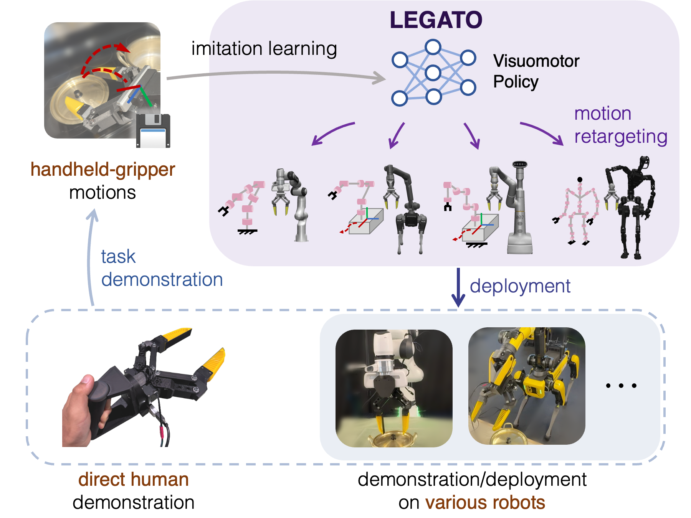

# LEGATO: Cross-Embodiment Imitation Using a Grasping Tool
[Mingyo Seo](https://mingyoseo.com), [H. Andy Park](https://www.linkedin.com/in/robodreamer/), [Shenli Yuan](https://yuanshenli.com), [Yuke Zhu](https://yukezhu.me/)&dagger;, [Luis Sentis](https://sites.google.com/view/lsentis)&dagger;

[Project](https://ut-hcrl.github.io/LEGATO) | [arXiv](https://arxiv.org/abs/2411.03682)



## Abstract
Cross-embodiment imitation learning enables policies trained on specific embodiments to transfer across different robots, unlocking the potential for large-scale imitation learning that is both cost-effective and highly reusable. This paper presents LEGATO, a cross-embodiment imitation learning framework for visuomotor skill transfer across varied kinematic morphologies. We introduce a handheld gripper that unifies action and observation spaces, allowing tasks to be defined consistently across robots. Using this gripper, we train visuomotor policies via imitation learning, applying a motion-invariant transformation to compute the training loss. Gripper motions are then retargeted into high-degree-of-freedom whole-body motions using inverse kinematics for deployment across diverse embodiments. Our evaluations in simulation and real-robot experiments highlight the framework’s effectiveness in learning and transferring visuomotor skills across various robots.

If you find our work useful in your research, please consider [citing](#citing).


## Dependencies
- Python 3.9.2 (recommended)
- [Robosuite  1.4.1](https://github.com/ARISE-Initiative/robosuite/tree/v1.4.1)
- [Robomimic 0.3.0](https://github.com/ARISE-Initiative/robomimic/tree/v0.3.0)
- [PyTorch](https://github.com/pytorch/pytorch)
- [pytorch3d](https://github.com/facebookresearch/pytorch3d) (We are using [these functions](https://github.com/UT-HCRL/LEGATO/tree/main/pytorch3d) from the original PyTorch3D repository.)


## Usage
Please see [Setup](docs/setup.md) and [Usage](docs/usage.md).


## Dataset and pre-trained models
We provide our demonstration dataset in simulation environment ([link](https://utexas.box.com/s/5twb8okdnfr2uhyf4fj3bh5ohu4w3o4r)) and trained models of the Visuomotor Policies ([link](https://utexas.box.com/s/392bihmqdulcwj5aqndl2w2hohxt1rza)).


## Real-robot scripts
We are currently working on open-sourcing the scripts for deploying on real robots.


## License
LEGATO is released under the [MIT License](LICENSE). The `flex_ik_solver` part of this code was produced as part of Mingyo Seo's internship at the Boston Dynamics AI Institute in 2023 and 2024 and is provided "as is" without active maintenance. For questions, please contact [Mingyo Seo](https://mingyoseo.com) or [H. Andy Park](https://www.linkedin.com/in/robodreamer/).


## Citing
```
@misc{seo2024legato,
    title={LEGATO: Cross-Embodiment Imitation Using a Grasping Tool},
    author={Seo, Mingyo and Park, H. Andy and Yuan, Shenli and Zhu, Yuke and
          and Sentis, Luis},
    year={2024}
    eprint={2411.03682},
    archivePrefix={arXiv},
    primaryClass={cs.RO}
}
```

## Fix
- Changed requirements.txt
- Removed "frontview" on models/base.xml
- Added Dockerfile

## How to use Docker container
0. Place your check point (pth) file on the root of this project
1. Build a container `docker build -t legato .`
2. Install nvidia container toolkit to use host's GPU
3. Disable access control by `xhost +`
4. `docker run --gpus all -e DISPLAY=$DISPLAY -v /tmp/.X11-unix:/tmp/.X11-unix -it --rm -p 5901:5901 -v $(pwd):/workspace/LEGATO legato`
5. Inside the container, `python scripts/sim_evaluate.py --task=lid --robot=abstract --seed=0 --ckpt_path='<TRAINING CHECKPOINT FILE PATH>'`
6. After finishing, on the host, `xhost -` to enable access control again


## Remote GUI reference
https://leimao.github.io/blog/Docker-Container-GUI-Display/