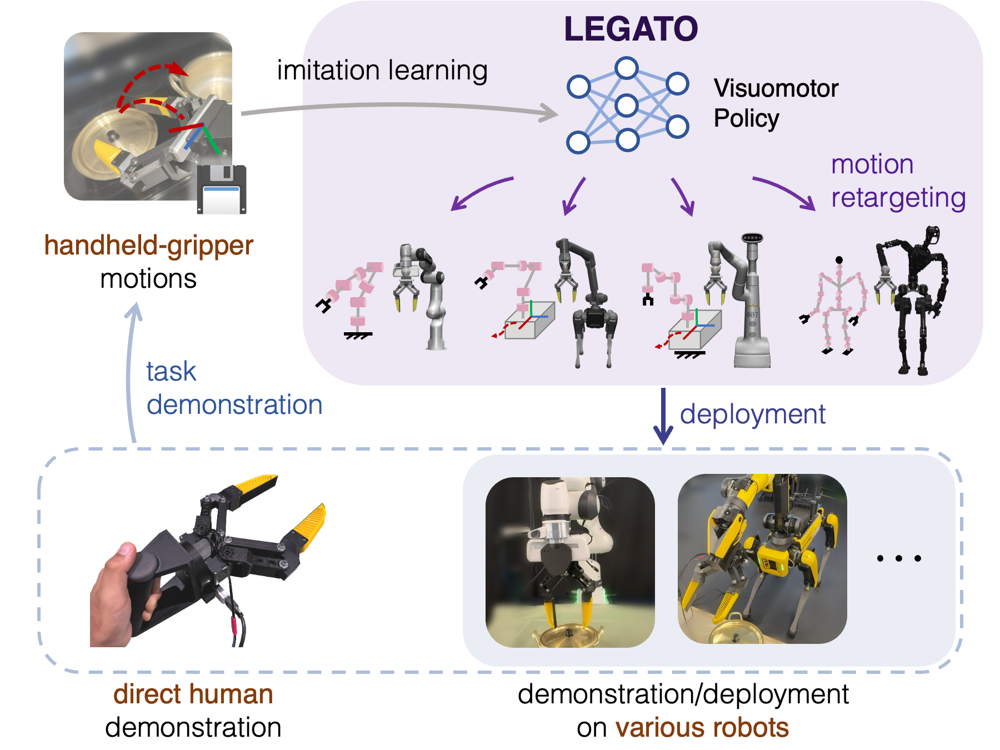
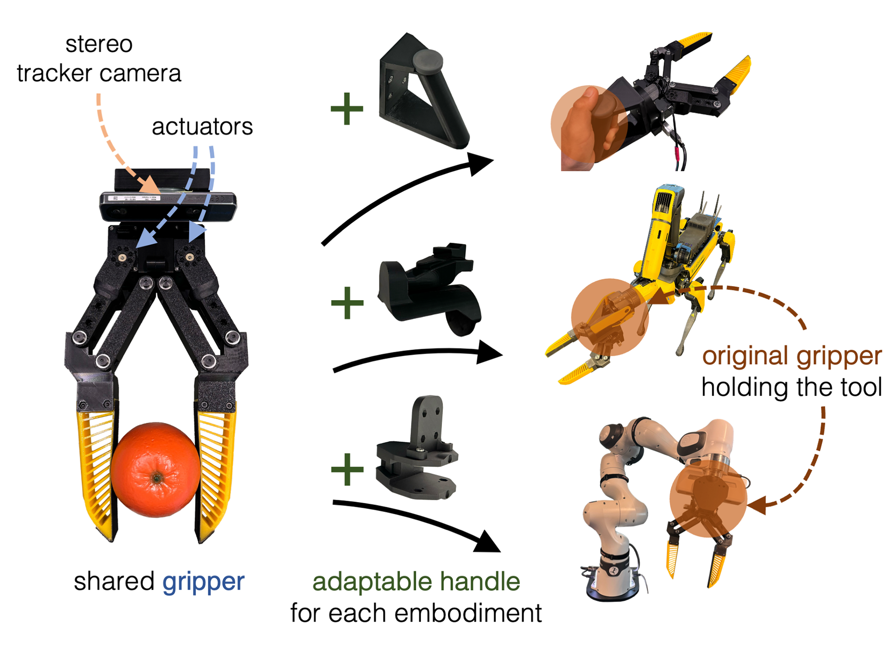
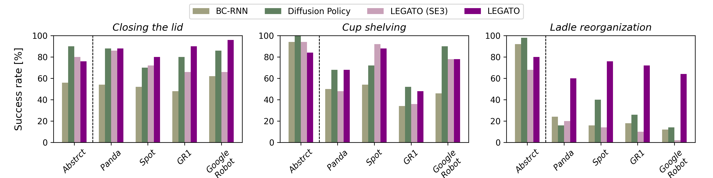

<link href='https://fonts.googleapis.com/css?family=Titillium+Web:400,600,400italic,600italic,300,300italic' rel='stylesheet' type='text/css'>
<head><meta http-equiv="Content-Type" content="text/html; charset=UTF-8">
  <title>LEGATO: Cross-Embodiment Imitation Using a Grasping Tool</title>

<!-- <meta property="og:image" content="src/figure/approach.png"> -->
<meta property="og:title" content="ETUDE">

<!-- Google tag (gtag.js) -->

<!-- STLviewer tag -->
<!--  -->

<link media="all" href="./css/glab.css" type="text/css" rel="StyleSheet">

<meta content="MSHTML 6.00.2800.1400" name="GENERATOR">

</head>

<body data-gr-c-s-loaded="true">

  <h1>
    <strong>LEGATO: Cross-Embodiment Imitation Using a Grasping Tool</strong>
  </h1>

  <h3>
    <a href="https://mingyoseo.com/">Mingyo Seo1,2</a>&nbsp;&nbsp;&nbsp;
    <a href="https://www.linkedin.com/in/robodreamer/">H. Andy Park2</a>&nbsp;&nbsp;&nbsp;
    <a href="https://yuanshenli.com/">Shenli Yuan2</a>&nbsp;&nbsp;&nbsp;
    <a href="https://yukezhu.me/">Yuke Zhu1&dagger;</a>&nbsp;&nbsp;&nbsp;
    <a href="https://www.ae.utexas.edu/people/faculty/faculty-directory/sentis/">Luis Sentis1,2&dagger;</a>&nbsp;&nbsp;&nbsp; 
  </h3>

  <h3>
    <a href="https://www.utexas.edu/">1The University of Texas at Austin</a>&nbsp;&nbsp;&nbsp;
    <a href="https://theaiinstitute.com/">2The AI Institute</a>&nbsp;&nbsp;&nbsp;
    &dagger; Equal advising
  </h3>

  <h2>
    <a href="http://arxiv.org/abs/XXXX.XXXXXX">Paper</a> | <a href="https://github.com/UT-HCRL/LEGATO">Code</a> | <a href="https://judicious-study-05b.notion.site/LEGATO-Gripper-fff873a1af8380f690bef81ab1f762a7?pvs=4">Hardware</a>
  </h2>

  

    
  

<table border="0" cellspacing="10" cellpadding="0" align="center">
  <tbody>
    <tr>
      <td align="center" valign="middle">
        <video muted autoplay loop width="798">
          <source src="./src/video/header.mp4"  type="video/mp4">
        </video>
      </td>
    </tr> 
  </tbody> 
</table>

  

    

      <table align=center width=800px>
        <tr>
          <td>
            

              Cross-embodiment imitation, where robots learn policies from demonstrations of these policies can be transferred to different robot embodiments, offers the potential for large-scale imitation learning that is both cost-effective and highly reusable.
   	      This paper presents <b>LEGATO</b>, a cross-embodiment imitation learning framework for visuomotor skills, facilitating the transfer of actions across various kinematic morphologies. 
              We introduce a wearable gripper that enables tasks to be defined within the same gripper's action and observation spaces across different robots.
	      Based on this wearable gripper, we train visuomotor policies through imitation learning, incorporating a motion-invariant transformation to compute the training loss. 
	      We then retarget gripper motions into high-DOF whole-body motions for deployment across diverse embodiments using inverse kinematics.
	     Our evaluation of simulations and real-robot experiments highlights the framework’s effectiveness in learning and transferring visuomotor skills across various robots.
	    

          </td>
        </tr>
      </table>
    

  

<h1 align="center">Cross-embodiment Learning Pipeline</h1>

<table border="0" cellspacing="10" cellpadding="0" align="center">
  <tbody>
    <tr>
      <td align="center" valign="middle">
        
      </td>
    </tr> 
  </tbody> 
</table>

<table align=center width=800px>
  <tr>
    <td>
      

      	We introcuce a cross-embodiment imitation learning framework that enables human demonstrations via direct interaction or robot teleoperation. Our framework uses the LEGATO Gripper, a versatile wearable gripper, to maintain consistent physical interactions across different robots. During data collection, our gripper records the trajectories and grasping actions of the wearable gripper, as well as visual observations from its egocentric stereo camera. Policies trained on these gripper motions can be deployed on various robots equipped with the same gripper. Motion retargeting using IK optimization enables these trajectories to be executed on different robots without the need for training data specific to any particular robot.
      

    </td>
  </tr>
</table>

<h1 align="center">Wearable Gripper Design</h1>

<table border="0" cellspacing="10" cellpadding="0" align="center">
  <tbody>
    <tr> 
      <td align="center" valign="middle">
        <video muted autoplay loop width="394">
          <source src="./src/video/mechanism.mp4"  type="video/mp4">
        </video>
      </td>
    </tr> 
  </tbody> 
</table>
<table border="0" cellspacing="10" cellpadding="0" align="center">
  <tbody>
    <tr>
      <td align="center" valign="middle">
        
      </td>
      <td align="center" valign="middle">
        <video muted autoplay loop width="394">
          <source src="./src/video/assembly.mp4"  type="video/mp4">
        </video>
      </td>
    </tr> 
  </tbody> 
</table>

<table align=center width=800px>
  <tr>
    <td> 
      

        The LEGATO Gripper is designed for both collecting human demonstrations and robot deployment.
        Its design features a shared actuated gripper with handles adapted to each embodiment, ensuring robust human handling. 
        This ensures consistent grasping actions while minimizing the number of parts necessary for direct human use and deployment across various robots.
      

    </td>
  </tr>
</table>

<table border="0" cellspacing="10" cellpadding="0" align="center">
  <tbody>
    <tr>
      <td align="center" valign="middle">
        <video muted controls loop width="394">
          <source src="./src/video/usage_human.mp4"  type="video/mp4">
        </video>
      </td>
      <td align="center" valign="middle">
        <video muted controls loop width="394">
          <source src="./src/video/usage_robot.mp4"  type="video/mp4">
        </video>
      </td>
    </tr>
  </tbody>
</table>

<table align=center width=800px>
  <tr>
    <td> 
      

        The LEGATO Gripper allows a human demonstrator to directly perform tasks by carrying it, using a simple button interface. 
        It is also designed to be easily installed on various robot systems by simply holding it with their original grippers.
      

    </td>
  </tr>
</table>

<h1 align="center">Whole-body Motion retargeting</h1>

<table border="0" cellspacing="10" cellpadding="0" align="center">
  <tbody>
    <tr>
      <td align="center" valign="middle">
        <video class="lazy-video" muted loop width="798">
          <source src="./src/video/whole-body_ik.mp4"  type="video/mp4">
        </video>
      </td>
    </tr> 
  </tbody> 
</table>

<table align=center width=800px>
  <tr>
    <td> 
      

        Motion retargeting through IK optimization adeptly navigates the kinematic differences and constraints across robot embodiments, exploiting kinematic redundancy without requiring additional robot-specific demonstrations for deployment.
      

    </td>
  </tr>
</table>

<h1 align="center">Real-robot Deployment</h1>

<table border="0" cellspacing="10" cellpadding="0" align="center">
  <tbody>
    <tr>
      <td align="center" valign="middle">
        <video class="lazy-video" muted loop width="798">
          <source src="./src/video/real_panda.mp4"  type="video/mp4">
        </video>
      </td>
    </tr> 
  </tbody> 
</table>

<h1 align="center">Simulation Evaluation</h1>

<table border="0" cellspacing="10" cellpadding="0" align="center">
  <tbody>
    <tr>
      <td align="center" valign="middle">
        
      </td>
    </tr>
  </tbody>
</table>

<table align=center width=800px>
  <tr>
    <td>
      

    	On average, LEGATO  outperforms the other methods in cross-embodiment deployment by 28.9%, 10.5%, and 21.1%, compared to <a href="https://arxiv.org/abs/2108.03298">BC-RNN</a>, <a href="https://arxiv.org/abs/2303.04137v5">Diffusion Policy</a>, and the self-variant of LEGATO trained only on SE3 (LEGATO (SE3)), respectively.
    	Notably, unlike the baselines that only achieved high success rates on specific robot bodies, typically the <i>Abstract</i> embodiment used for training, LEGATO demonstrates consistent success across different embodiments.
      

    </td>
  </tr>
</table>

<table border="0" cellspacing="10" cellpadding="0" align="center">
  <tbody>
    <tr>
      <td align="center" valign="middle">
        <video class="lazy-video" muted loop width="598">
          <source src="./src/video/sim_lid.mp4"  type="video/mp4">
        </video>
      </td>
    </tr>
    <tr>
      <td align="center" valign="middle">
        <video class="lazy-video" muted loop width="598">
          <source src="./src/video/sim_cup.mp4"  type="video/mp4">
        </video>
      </td>
    </tr>
    <tr>
      <td align="center" valign="middle">
        <video class="lazy-video" muted loop width="598">
          <source src="./src/video/sim_ladle.mp4"  type="video/mp4">
        </video>
      </td>
    </tr>
  </tbody>
</table>

<h1>Citation</h1>

<table align=center width=800px>
  <tr>
    <td>
    <!-- <left> -->
    <pre><code style="display:block; overflow-x: auto">
      @misc{seo2024legato,
        title={LEGATO: Cross-Embodiment Visual Imitation Using a Grasping Tool},
        author={Seo, Mingyo and Park, H. Andy and Yuan, Shenli and Zhu, Yuke and
          and Sentis, Luis},
        year={2024}
        eprint={XXXX.XXXXXX},
        archivePrefix={arXiv},
        primaryClass={cs.RO}
      }
    </code></pre>
    <!-- </left> -->
    </td>
  </tr>
</table>
